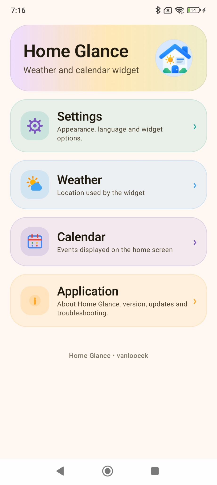
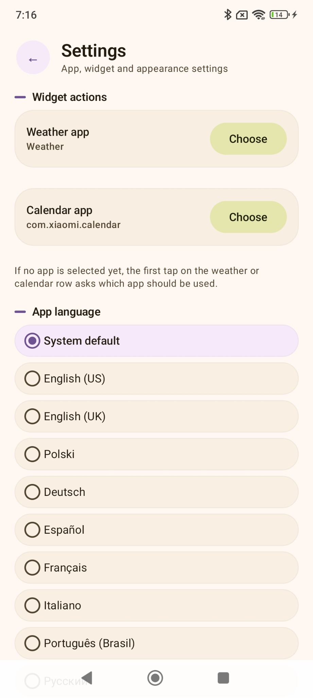
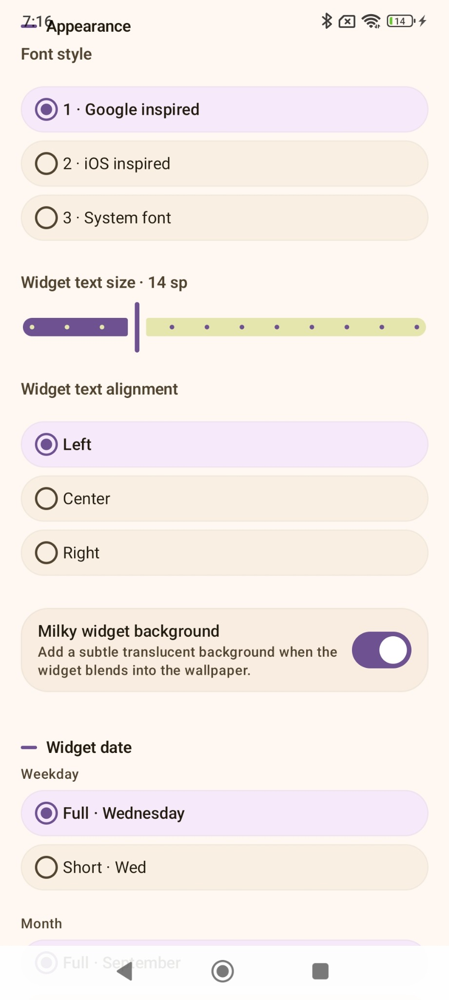
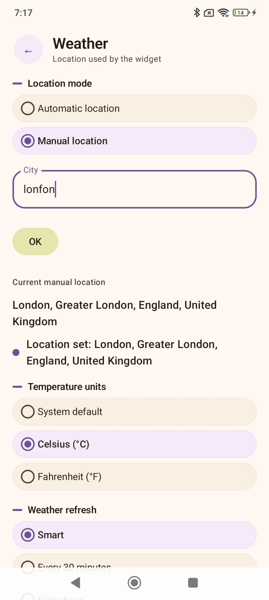
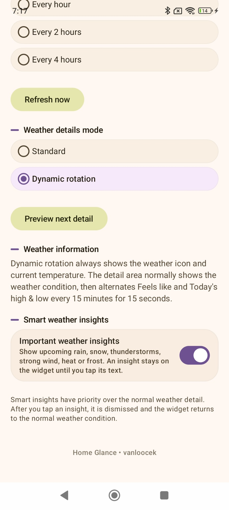
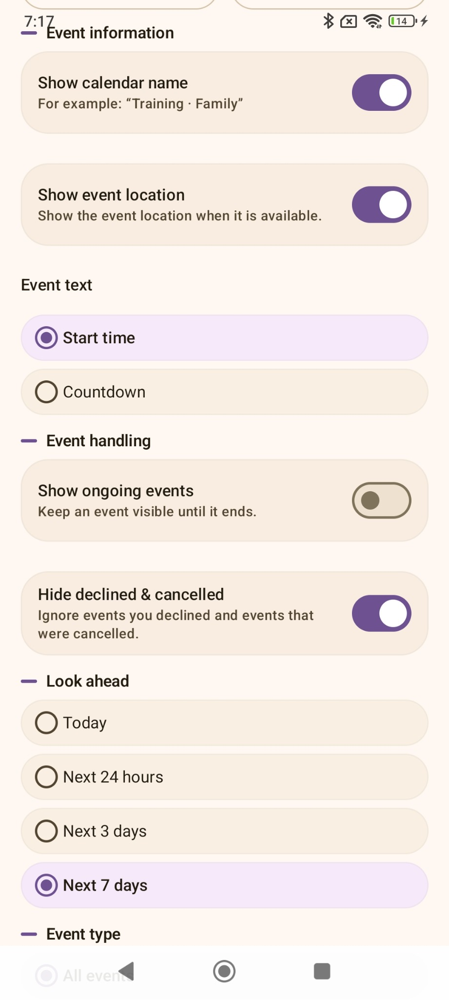
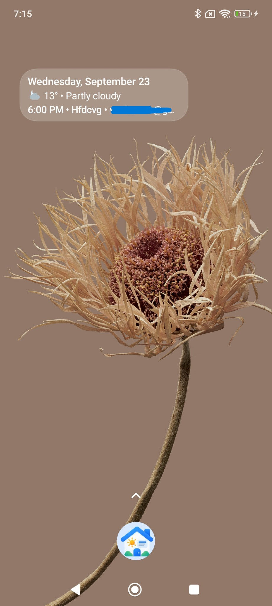

# Home Glance

A lightweight Android home-screen widget that combines weather and calendar information in a clean, Pixel-inspired layout.

> **Latest public APK:** Home Glance v0.2.2 · Public test prerelease

[Download Home Glance v0.2.2 APK](https://github.com/vanloocek-collab/Home-Glance-Releases/releases/download/0.2.2/Home-Glance-v0.2.2.apk)

This repository contains public downloads, the [project website](https://vanloocek-collab.github.io/Home-Glance-Releases/), documentation and issue tracking. App source development is maintained separately.

Development and experimental test builds can contain changes that are not included in v0.2.2. The features and release highlights below describe the published APK; unreleased work is not a new public release.

## Why Home Glance?

I have always been a big fan of **Another Widget**. After it stopped evolving, I decided to create what I see as its spiritual successor: a modern, actively developed widget that keeps the same idea of showing the information you need at a glance, while adding more customization, broader device compatibility and new features.

There is another reason behind Home Glance too: it is for Android users who like the clean, Pixel-like look, but do not want to switch to a custom ROM just to get it — especially when keeping **Strong Play Integrity** matters to them. Home Glance aims to bring a little of that clean-Android feel to the home screen while letting users keep their existing system setup.

Home Glance is an independent project and is not affiliated with Another Widget.

## Features

- Current weather, condition icon and temperature
- Automatic or manual location
- Celsius / Fahrenheit / system units
- Smart weather refresh intervals
- Dynamic weather detail rotation
- Smart weather insights for rain, snow, thunderstorms, strong wind, heat and frost
- Calendar integration with selectable calendars
- Event start time or countdown
- Ongoing-event support, event location and calendar name
- Event filters and configurable look-ahead
- Widget backgrounds: **No background, Material You and Liquid Glass**, with adjustable wallpaper visibility
- Google-inspired, iOS-inspired and system font styles
- Adjustable widget text size and alignment
- Custom weekday and month formatting
- Long-text scrolling for date/alarm, weather and calendar, with per-line controls and configurable pause
- Optional next-alarm time beside the date
- Quick widget refresh directly from the Home dashboard
- Direct launch of supported weather and calendar apps
- In-app update checker
- In-app bug reporting through GitHub Issues
- Direct email contact with the developer for users without a GitHub account

## Languages

Home Glance includes an in-app language selector with:

**English (US), English (UK), Polski, Deutsch, Español, Français, Italiano, Português (Brasil), Русский, 简体中文 and 日本語.**

## Weather app compatibility

Home Glance can detect supported weather apps installed on the device, including:

- Google / Pixel Weather
- Xiaomi / POCO Weather
- Samsung Weather
- Motorola Weather
- OnePlus / OPPO / ColorOS Weather
- Huawei Weather
- Honor Weather

Availability depends on the device and installed system apps.

## Screenshots

These are reference screenshots from earlier builds. Some screens and background options have changed; they are not a version-matched screenshot set for v0.2.2. The older “Milky” preview is retained as a visual reference, while the published app offers No background, Material You and Liquid Glass.

<table>
  <tr>
    <td align="center"> <b>Home</b></td>
    <td align="center"> <b>Languages</b></td>
    <td align="center"> <b>Appearance</b></td>
  </tr>
  <tr>
    <td align="center"> <b>Weather location</b></td>
    <td align="center"> <b>Smart weather</b></td>
    <td align="center"> <b>Calendar</b></td>
  </tr>
</table>

   
  <b>Home Glance widget on the Android home screen</b>

## Requirements

- Android 8.0 (API 26) or newer
- Internet connection for weather data
- Location permission when using automatic weather location
- Calendar permission when calendar events are enabled

## Installation

1. Download the APK from the latest release.
2. Open the downloaded file on your Android device.
3. Allow installation from this source if Android asks for permission.
4. Install Home Glance.
5. Add the **Home Glance** widget to your home screen and configure it in the app.

Updating in place requires the same package name and signing key as the installed app. Compatible updates preserve settings. Debug, Google Play and GitHub builds may not be interchangeable; include the build source when reporting an installation problem.

## v0.2.2 highlights

- Fixed incorrect and stale next-alarm times on Xiaomi / POCO devices
- Fixed temporary `00:00` after disabling an alarm on HyperOS
- Added direct monitoring of Xiaomi / POCO alarm-setting changes for reliable automatic updates
- Fixed duplicate ticker text on some POCO and OnePlus launchers
- Fixed weather text clipping on Xiaomi / POCO
- Fixed date text remaining clipped after widget resize
- Improved Refresh Widget full rebuilds and Dynamic Weather transition stability

## v0.2.1 highlights

- Calendar additions, edits and reminder changes can refresh the widget automatically within a few seconds
- Added Android Calendar provider change monitoring without keeping a background process alive
- Fixed unwanted ellipsis in long Standard weather text
- Fixed a first-cycle calendar ticker glitch after dismissing a smart weather insight
- Kept the regular 30-minute Android widget refresh as a fallback

## v0.2.0 highlights

- Completely redesigned Home Glance interface with a Bento-style dashboard
- Added quick widget refresh with real refresh progress and completion feedback
- Added long-text scrolling to all three widget lines
- Added separate scrolling controls for the date/alarm, weather and calendar lines
- Added configurable pause between scrolls and natural clipping when scrolling is disabled
- Added optional next-alarm information beside the date
- Replaced the old Milky background with **Material You** and **Liquid Glass** options
- Added adjustable wallpaper visibility for widget backgrounds
- Improved widget resizing and behaviour on narrow layouts
- Existing settings and widget configuration are preserved when updating from previous versions

## Feedback and support

- [Report a bug or request a feature](https://github.com/vanloocek-collab/Home-Glance-Releases/issues/new/choose)
- [Support guide](SUPPORT.md)
- [Security policy](SECURITY.md)

## Contributing

[How to contribute](CONTRIBUTING.md)

## Testing

[View the Home Glance Testing Checklist](TESTING.md)

## Roadmap

[View the Home Glance Roadmap](ROADMAP.md)

## Privacy

[Read the Home Glance Privacy Policy](PRIVACY.md)

## Status

Home Glance is still in public testing. Feedback and bug reports are welcome.

[View Home Glance v0.2.2 release notes](https://github.com/vanloocek-collab/Home-Glance-Releases/releases/tag/0.2.2)
