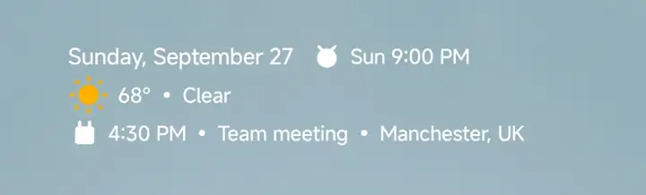

# Home Glance

A lightweight Android home-screen widget for weather, calendar, next alarm and useful contextual information in a clean, Pixel-inspired layout.

**Current public release:** v0.2.3 · Public test prerelease  
**Android:** 8.0+ (API 26)

[Website](https://vanloocek-collab.github.io/Home-Glance-Releases/) · [Download](https://github.com/vanloocek-collab/Home-Glance-Releases/releases/latest) · [Screenshots](https://vanloocek-collab.github.io/Home-Glance-Releases/screenshots.html) · [Roadmap](https://vanloocek-collab.github.io/Home-Glance-Releases/roadmap.html) · [Issues](https://github.com/vanloocek-collab/Home-Glance-Releases/issues) · [Privacy](https://vanloocek-collab.github.io/Home-Glance-Releases/privacy.html)

> This is the public distribution, documentation and issue-tracking repository for Home Glance. App source development is maintained separately.

## Help bring Home Glance to Google Play

Home Glance is preparing for its first Google Play release. Google requires a **closed test with at least 12 testers for 14 days** before production access can be requested.

If you use Home Glance — or simply want to help the project reach Google Play — join the tester group:

**[Join Home Glance Testers](https://groups.google.com/g/home-glance-testers)**

No payment, subscription or testing experience is required. The Google Play opt-in link will be added here as soon as the closed-test release is approved.

**Goal:** 12 testers · 14 days

## About

Home Glance was created as a modern spiritual successor to the idea behind **Another Widget**: show the information you need at a glance, keep the home screen calm, and provide deeper customization only when you want it.

The project is independently developed and is not affiliated with Google, Pixel At a Glance or Another Widget.

## Features

- Current weather with automatic or manual location
- Celsius / Fahrenheit / system units
- Dynamic weather details and smart weather insights
- Calendar integration with selectable calendars and event filters
- Event start time or countdown, ongoing events, location and calendar name
- Optional next-alarm information beside the date
- No background, Material You and Liquid Glass widget backgrounds
- Adjustable text size, alignment, date formatting and font style
- Independent long-text scrolling for date/alarm, weather and calendar
- Direct launch of supported weather and calendar apps
- Quick widget refresh from the Home dashboard
- In-app update checker for the GitHub build
- Built-in bug reporting and developer contact
- 11 interface languages

## Screenshot

  

More: [screenshots](https://vanloocek-collab.github.io/Home-Glance-Releases/screenshots.html) · [wallpapers](https://vanloocek-collab.github.io/Home-Glance-Releases/wallpapers.html)

## Installation

1. Open the [latest release](https://github.com/vanloocek-collab/Home-Glance-Releases/releases/latest).
2. Download the APK.
3. Install it on Android.
4. Add the **Home Glance** widget to the home screen.
5. Configure the widget from the app.

Compatible updates preserve settings. Debug, Google Play and GitHub builds may use different signing/distribution paths and are not always interchangeable.

## Current release highlights

### v0.2.3

- New Soft Pixel home banner
- Responsive next-alarm layout for narrow widgets
- Larger weather icon and refined alarm/calendar glyphs
- Compact pinned Live Preview in settings
- Restored long-text scrolling
- Improved alarm width calculations and Android alarm-screen fallback
- Validated on OnePlus 12, POCO X5 Pro, POCO X3 NFC and Motorola Edge 60 Pro

For previous versions, see [GitHub Releases](https://github.com/vanloocek-collab/Home-Glance-Releases/releases).

## Testing and feedback

Home Glance is still in public testing. Reports from different Android versions, manufacturers and launchers are especially useful.

- [Report a bug or request a feature](https://github.com/vanloocek-collab/Home-Glance-Releases/issues/new/choose)
- [Testing checklist](docs/TESTING.md)
- [Contributing guide](.github/CONTRIBUTING.md)
- [Support](.github/SUPPORT.md)
- [Security policy](.github/SECURITY.md)

## Roadmap

Development priorities are documented in [docs/ROADMAP.md](docs/ROADMAP.md) and on the public [roadmap page](https://vanloocek-collab.github.io/Home-Glance-Releases/roadmap.html).

The current order is:

1. Music widget
2. Wireless-headphones widget
3. Layout, typography and tap-action parity
4. Clock, calendar and weather parity
5. Smart Glance providers

## Repository structure

- `.github/` — issue templates and community/support documents
- `assets/` — website assets and wallpapers
- `docs/` — testing and development roadmap
- `google-play/` — Google Play publishing pack
- `screenshots/` — current product screenshots
- `*.html`, `site.css`, `site.js` — GitHub Pages website

## Privacy

Read the public [Privacy Policy](https://vanloocek-collab.github.io/Home-Glance-Releases/privacy.html) or the repository copy in [PRIVACY.md](PRIVACY.md).
